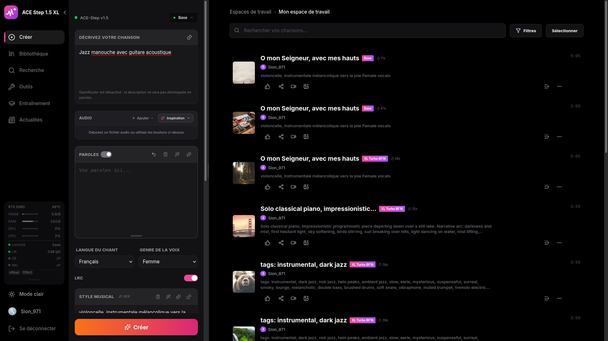
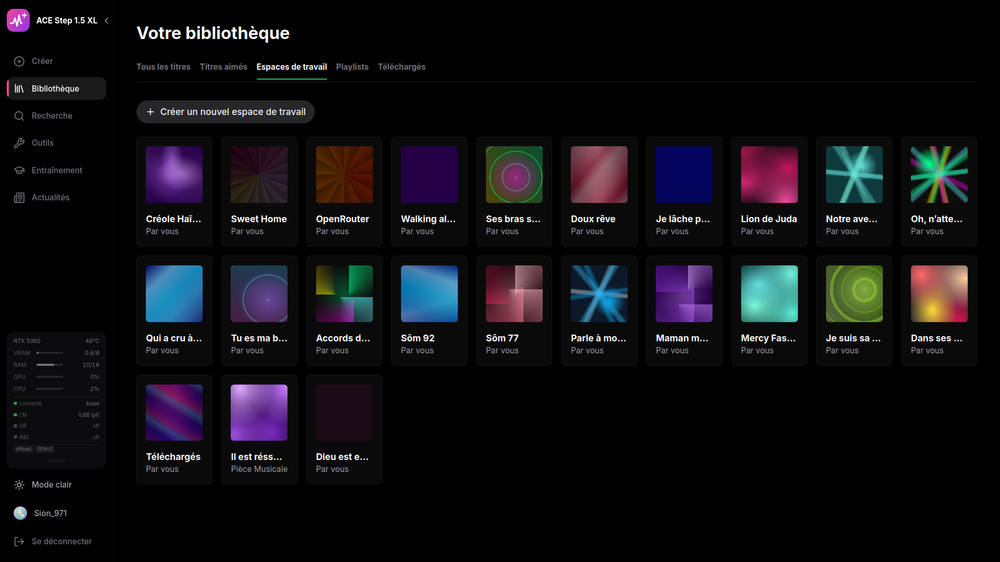
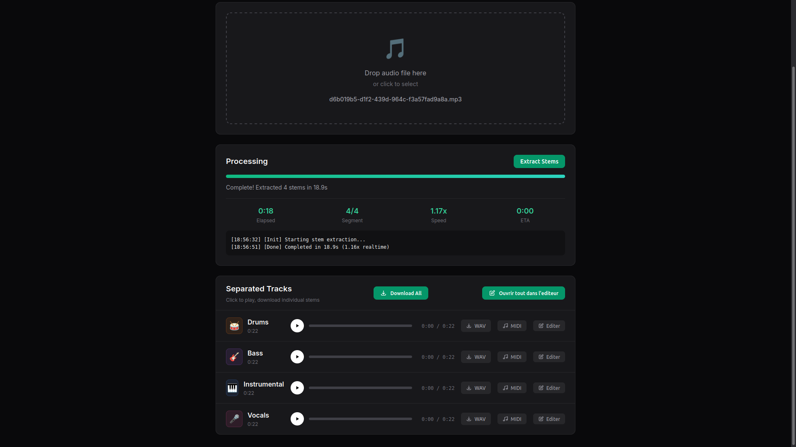
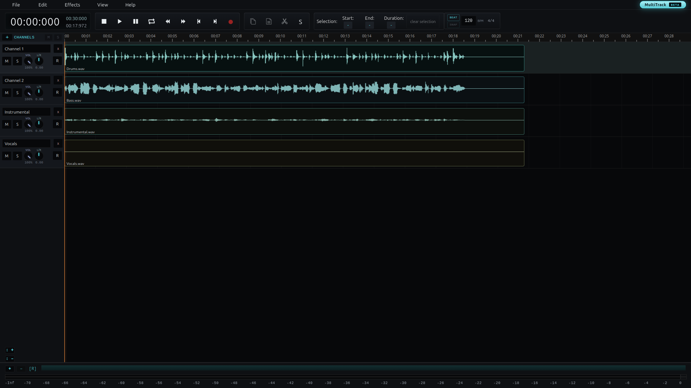

<p align="center">
  
</p>

<h1 align="center">ACE-Step Studio (Linux)</h1>

<p align="center">
  
  <a href="https://github.com/Sion971/ace-step-studio?tab=MIT-1-ov-file"></a>
  
</p>

<p align="center">
  
  
  
</p>

---

## 🐧 About this fork

This is a **Linux-focused fork** of [timoncool/ACE-Step-Studio](https://github.com/timoncool/ACE-Step-Studio), itself built on [AmbsdOP's ACE-Step UI](https://github.com/fspecii/ace-step-ui). It's been substantially reworked and extended for a Linux workflow — developed and tested on Linux Mint with an NVIDIA RTX GPU, with a one-shot installer that handles GPU detection, driver-aware compiler checks, and every dependency down to the isolated MIDI conversion environment.

If you're on Windows or macOS, the [upstream project](https://github.com/timoncool/ACE-Step-Studio) is the better starting point — this fork trades cross-platform support for going deep on one platform.

**What's different from upstream:**

- **Playlists vs. Workspaces** — a real separation between curated playlists and working sessions, with exclusive workspace membership (a song lives in one workspace at a time) and a virtual "default" view computed by exclusion.
- **MIDI conversion, server-side** — [basic-pitch](https://github.com/spotify/basic-pitch) running in an isolated Python 3.11 environment (its TensorFlow dependency doesn't ship wheels for newer Python), converting stems to MIDI in seconds rather than tens of minutes in-browser.
- **AudioMass, updated and wired in** — upgraded to the multitrack build, with direct-load support: open a single stem or all four Demucs stems together as separate tracks, straight from the browser, no manual export/import round-trip.
- **LoRA training from the UI** — the full scan → label → preprocess → train pipeline, drivable from React without dropping into Gradio directly.
- **One installer, GPU-aware** — detects your actual compute capability and compiler version, not just a menu choice, and knows when `flash-attn` will and won't build correctly for your hardware (Blackwell/RTX 50-series needs CUDA 12.8+ to compile it at all — the installer checks this before attempting a multi-hour build that's doomed to fail).

---

## 🎬 Screenshots

<p align="center">
  
</p>

<p align="center">
  <em>Generation panel, workspace view, and the bottom player — all in one screen.</em>
</p>

<table>
  <tr>
    <td width="50%"></td>
    <td width="50%"></td>
  </tr>
  <tr>
    <td align="center"><em>Workspaces, organized visually</em></td>
    <td align="center"><em>Stem extraction — WAV, MIDI, or straight to the editor</em></td>
  </tr>
</table>

<p align="center">
  
</p>

<p align="center">
  <em>All four Demucs stems, opened together as separate tracks in the AudioMass editor.</em>
</p>

---

## ✨ Features

### 🎵 AI Music Generation
| Feature | Description |
|---------|-------------|
| **Full Song Generation** | Create complete songs with vocals and lyrics up to 4+ minutes |
| **Instrumental Mode** | Generate instrumental tracks without vocals |
| **Custom Mode** | Fine-tune BPM, key, time signature, and duration |
| **Style Tags** | Define genre, mood, tempo, and instrumentation |
| **Batch Generation** | Generate multiple variations at once |
| **AI Enhance** | Enrich genre tags into detailed captions with proper BPM/key/time |
| **Thinking Mode** | Let AI reason about structure and generate audio codes |

### 🎨 Advanced Parameters
| Feature | Description |
|---------|-------------|
| **Reference Audio** | Use any audio file as a style reference |
| **Audio Cover** | Transform existing audio with new styles |
| **Repainting** | Regenerate specific sections of a track |
| **Seed Control** | Reproduce exact generations for consistency |
| **Inference Steps** | Control quality vs speed tradeoff |

### 🎤 Lyrics & Prompts
| Feature | Description |
|---------|-------------|
| **Lyrics Editor** | Write and format lyrics with structure tags |
| **Format Assistant** | AI-powered caption and lyrics formatting |
| **Prompt Templates** | Quick-start with genre presets |
| **Reuse Prompts** | Clone settings from any previous generation |

### 📁 Library Organization
| Feature | Description |
|---------|-------------|
| **Playlists** | Curated collections, a song can belong to several |
| **Workspaces** | Active working sessions — a song belongs to exactly one at a time |
| **Default View** | Everything not currently assigned to a workspace |
| **Bottom Player** | Full-featured player with waveform and progress |
| **Real-time Progress** | Live generation progress with queue position |
| **LAN Access** | Use from any device on your local network |

### 🛠️ Built-in Tools
| Feature | Description |
|---------|-------------|
| **Multitrack Audio Editor** | Trim, fade, and mix with AudioMass — open single stems or all four together as separate tracks |
| **Stem Extraction** | Separate vocals, drums, bass, and other with Demucs, in-browser |
| **MIDI Conversion** | Turn any stem into MIDI server-side, in seconds |
| **LoRA Training** | Full training pipeline, driven from the UI |
| **Video Generator** | Create music videos with Pexels backgrounds |
| **Gradient Covers** | Procedural album art, no internet needed |

---

## 💻 Tech Stack

| Layer | Technologies |
|-------|-------------|
| **Frontend** | React 18, TypeScript, TailwindCSS, Vite |
| **Backend** | Express.js, SQLite, better-sqlite3 |
| **AI Engine** | [ACE-Step 1.5](https://github.com/ace-step/ACE-Step-1.5) (Gradio API) |
| **Audio Tools** | AudioMass (multitrack), Demucs, basic-pitch, FFmpeg |

---

## 📋 Requirements

| Requirement | Specification |
|-------------|---------------|
| **OS** | Linux (developed on Linux Mint / Ubuntu 24.04) |
| **Node.js** | 22 LTS |
| **Python** | 3.12 (main env), 3.11 (isolated, for MIDI conversion only) |
| **NVIDIA GPU** | 4GB+ VRAM (works without LLM), 12GB+ recommended (with LLM) |
| **CUDA compiler (`nvcc`)** | 12.8+ if you want `flash-attn` on Blackwell (RTX 50-series) — older cards work with older `nvcc` too, the installer checks and falls back to SDPA if not |
| **FFmpeg, libsndfile** | Installed automatically by the installer if missing |
| **uv** | Python package manager — installed automatically if missing |

---

## ⚡ Quick Start

```bash
# 1. Clone this repo and ACE-Step-1.5 side by side (see full install below)
git clone https://github.com/Sion971/ace-step-studio.git
cd ace-step-studio

# 2. Run the installer — handles GPU detection, PyTorch, dependencies,
#    database migration, and the isolated MIDI conversion environment
./install.sh

# 3. Start everything (frontend + backend + AI engine) in one terminal
./run.sh
```

That's it — the UI opens automatically at `http://localhost:3001`.

---

## 📦 Installation

### 1. Get ACE-Step 1.5 (the AI engine)

```bash
git clone https://github.com/ace-step/ACE-Step-1.5.git
```

Place it alongside this repo — `run.sh` expects `../ACE-Step-1.5` relative to this project by default (configurable).

### 2. Clone this repo and run the installer

```bash
git clone https://github.com/Sion971/ace-step-studio.git
cd ace-step-studio
./install.sh
```

The installer walks through twelve steps, all self-checking and safe to re-run:

1. System dependencies (FFmpeg, libsndfile) via apt, only if missing
2. Working directory structure
3. GPU / CUDA selection (Pascal through Blackwell, or CPU-only)
4. Python virtual environment (via `uv`)
5. Build tools
6. PyTorch, matched to your selected CUDA version
7. NVIDIA NPP (a `torchcodec` runtime dependency that PyTorch doesn't pull in on its own)
8. ACE-Step dependencies, including a real compute-capability check before attempting `flash-attn` — skips it cleanly (falling back to SDPA) rather than burning hours on a build that can't succeed on your hardware
9. `torchcodec` load verification
10. Node.js check, npm install, frontend build
11. Database migration (playlist/workspace schema) — idempotent, safe on every reinstall
12. Isolated `basic-pitch` environment for MIDI conversion (Python 3.11 via deadsnakes PPA)

Models download automatically on first run (~5GB).

### 3. Start the app

```bash
./run.sh
```

**Options:**

| Flag | Effect |
|------|--------|
| `--no-lm` | Skip the local 5Hz LM (0.6B) — frees ~1GB VRAM, good for LoRA training |
| `--gradio-only` | ACE-Step's own Gradio UI only (port 8001), no Express/React frontend — needed for dataset labeling |
| `--no-browser` | Don't auto-open a browser tab |
| `--port <n>` | Web server port (default 3001) |

---

## 🎼 Generation Modes

### Simple Mode
Just describe your song in natural language — genre, mood, instruments — and let ACE-Step handle the rest.

### Custom Mode
Fine-grained control over BPM, key, time signature, duration, and structure tags in your lyrics.

### AI Enhance & Thinking Mode
AI Enhance enriches short genre tags into detailed captions with proper metadata. Thinking Mode lets the model reason about song structure before generating audio codes — better results, more VRAM.

### Batch Size & Bulk Generation
Generate several variations of the same prompt in one pass to compare results quickly.

---

## 🔧 Built-in Tools

**Audio Editor (AudioMass, multitrack)** — trim, fade, apply effects. Open a single stem directly from your library, or send all four Demucs stems over together as separate tracks in one editor session.

**Stem Extraction (Demucs)** — runs in-browser via ONNX, separates vocals/drums/bass/other. Each stem can be downloaded, converted to MIDI, or sent straight to the editor.

**MIDI Conversion (basic-pitch)** — runs server-side in its own isolated environment, converts any stem to MIDI in seconds.

**LoRA Training** — scan your dataset, label, preprocess, and train, all from the UI.

**Video Generator** — turn a track into a music video with Pexels stock backgrounds.

---

## 🐛 Troubleshooting

| Issue | Solution |
|-------|----------|
| **ACE-Step not reachable** | Ensure Gradio server is running with `--enable-api` (handled automatically by `run.sh`) |
| **CUDA out of memory** | Set batch size to **1**, reduce duration, or disable Thinking Mode |
| **4GB GPU — Out of memory** | Batch size **1**, Thinking Mode **off**. LLM features need 12GB+ |
| **`flash-attn` build fails or errors at runtime** | Check your `nvcc` version supports your GPU's compute capability — see `install.sh` step 8, or fall back to `--no-lm` if you just need generation working now |
| **Songs show 0:00 duration** | `sudo apt install ffmpeg` |
| **LAN access not working** | Check firewall allows the port you're running on (default 3001) |

More detail in `TROUBLESHOOTING.md`.

---

## 🙏 Credits

- **[ACE-Step](https://github.com/ace-step/ACE-Step-1.5)** — the underlying open source AI music generation model
- **[timoncool/ACE-Step-Studio](https://github.com/timoncool/ACE-Step-Studio)** — the project this fork is built on
- **[AmbsdOP/ace-step-ui](https://github.com/fspecii/ace-step-ui)** — the original UI this was in turn based on
- **[@bdsqlsz](https://space.bilibili.com/29863478)** — Chinese localization, carried over from upstream
- **[AudioMass](https://github.com/pkalogiros/AudioMass)** — web audio editor
- **[Demucs](https://github.com/facebookresearch/demucs)** — audio source separation
- **[basic-pitch](https://github.com/spotify/basic-pitch)** — audio-to-MIDI conversion
- **[Pexels](https://www.pexels.com)** — stock video backgrounds

Built with [Claude](https://claude.ai) (Anthropic) as a development pair — most of this fork's Linux port, features, and this very README were worked through together, session by session.

---

## 🤝 Contributing

This started as a personal project to get ACE-Step Studio running well on Linux, and it's grown from there. It's not actively looking for contributors, but issues, questions, and pull requests are welcome if something's broken or you've got an improvement in mind.

---

## 📄 License

MIT License — see [LICENSE](LICENSE). Original copyright retained; this fork's changes are released under the same terms.

---

<p align="center">
  <em>Built on the shoulders of ACE-Step, AudioMass, Demucs, and everyone who worked on this UI before it got here.</em>
</p>
